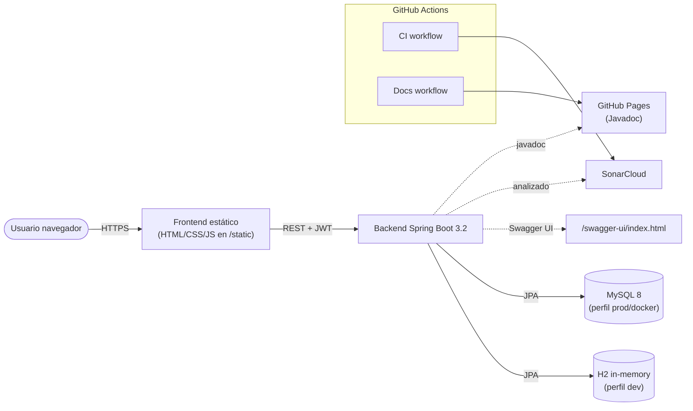

# EventPass - Plataforma de Eventos y Entradas
[](https://github.com/GorkaVillalba/ProyectoProcesosSoftware/actions/workflows/ci.yml)
[](https://sonarcloud.io/summary/new_code?id=GorkaVillalba_ProyectoProcesosSoftware)
[](https://sonarcloud.io/summary/new_code?id=GorkaVillalba_ProyectoProcesosSoftware)
[](https://sonarcloud.io/summary/new_code?id=GorkaVillalba_ProyectoProcesosSoftware)
[](https://sonarcloud.io/summary/new_code?id=GorkaVillalba_ProyectoProcesosSoftware)
[](https://sonarcloud.io/summary/new_code?id=GorkaVillalba_ProyectoProcesosSoftware)
[](http://localhost:8080/swagger-ui/index.html)
[](https://gorkavillalba.github.io/ProyectoProcesosSoftware/)


## Descripción
EventPass es una plataforma web que permite a organizadores crear y gestionar eventos,
y a asistentes comprar entradas con precio dinámico según ocupación.

## Stack Tecnológico
- **Backend:** Java 17 + Spring Boot 3.2
- **Persistencia:** JPA/Hibernate + MySQL (prod) / H2 (dev)
- **Seguridad:** Spring Security + JWT
- **Testing:** JUnit 5 + Mockito
- **CI/CD:** GitHub Actions
- **Contenedores:** Docker + Docker Compose

## Arquitectura



## Requisitos
- Java 17+
- Gradle 8+
- Docker y Docker Compose (para producción)

## Ejecución Local (H2)
```bash
./gradlew bootRun
```
La app arranca en http://localhost:8080
Consola H2: http://localhost:8080/h2-console

## Ejecución con Docker (MySQL)

### Prerrequisitos
- **Docker Desktop arrancado** antes de cualquier comando `docker-compose`.
  En Windows/Mac es obligatorio: Docker Desktop proporciona el daemon (motor)
  de Docker. Sin él, `docker-compose` falla con un error de tipo
  `failed to connect to the docker API at npipe:////./pipe/dockerDesktopLinuxEngine`
  (Windows) o equivalente. Solo en Linux el daemon puede correr como servicio
  del sistema sin UI.
- Puertos `8080` (app) y `3306` (MySQL) libres en el host.

### Arranque
```bash
docker-compose up --build -d
```
La primera build tarda ~1–3 min (descarga JDK + dependencias Gradle + compila).
Cuando termina, la app está en http://localhost:8080.

### Smoke test manual (T-24.3)
Con los contenedores arriba, hacer el flujo en el navegador:
**registro → login → comprar entrada → cancelar → logout**.

Verificar persistencia (clave: **NO usar `-v`** para conservar el volumen
`mysql_data`):
```bash
docker-compose down       # mantiene los datos
docker-compose up -d
# La cuenta y la entrada cancelada deben seguir ahí.
```

Limpieza total (borra los datos):
```bash
docker-compose down -v    # también elimina el volumen mysql_data
```

### Troubleshooting

| Síntoma | Causa | Solución |
|---|---|---|
| `failed to connect to the docker API at npipe:////./pipe/dockerDesktopLinuxEngine` | Docker Desktop no está arrancado | Abrir Docker Desktop y esperar a que el icono esté en verde antes de relanzar |
| Se queda en `gradle build` mucho rato | Primera build descarga JDK + dependencias (~45s–3min es normal) | Esperar. Si tarda más de 5 min, revisar recursos asignados en Docker Desktop → Settings → Resources |
| `port 8080/3306 already in use` | Otro proceso ocupa el puerto | Cerrar el proceso o cambiar el mapeo en `docker-compose.yml` |
| `eventpass-app` se reinicia en bucle | Suele ser conexión a MySQL | `docker-compose logs app` y `docker-compose logs mysql` para ver el error |
| Los datos no persisten tras `down`/`up` | Se usó `docker-compose down -v` (borra volúmenes) | Usar `down` sin `-v` |

## Tests y cobertura

Ejecutar tests unitarios:
```bash
./gradlew test
```

Generar el reporte de cobertura JaCoCo (HTML + XML):
```bash
./gradlew test jacocoTestReport
```
- HTML: `build/reports/jacoco/test/html/index.html`
- XML:  `build/reports/jacoco/test/jacocoTestReport.xml`

Verificar el umbral mínimo de cobertura (85% de líneas sobre packages de negocio):
```bash
./gradlew jacocoTestCoverageVerification
```

Se excluyen del cálculo: `config`, `dto`, `exception`, `security`, `model` y la clase `ProyectoApplication`.

## Datos de demo

El perfil demo carga 4 usuarios con contraseña `Demo1234!`, 5 eventos
cubriendo todos los tramos de precio dinámico y 4 tickets (3 válidos + 1 cancelado).

### Arranque con datos de demo
./gradlew bootRun --args='--spring.profiles.active=demo'

### Cuentas de demo
| Email           | Password   | Rol         | Para qué                                  |
|-----------------|------------|-------------|-------------------------------------------|
| org@demo.com    | Demo1234!  | Organizador | Crear/editar/eliminar eventos. Ver stats. |
| alice@demo.com  | Demo1234!  | Asistente   | Tiene 2 entradas válidas.                 |
| bob@demo.com    | Demo1234!  | Asistente   | Tiene 1 entrada válida.                   |
| carol@demo.com  | Demo1234!  | Asistente   | Tiene 1 entrada cancelada.                |


## Endpoints Principales
| Método | Endpoint | Descripción |
|--------|----------|-------------|
| POST | /api/users | Registro |
| POST | /api/auth/login | Login (JWT) |
| GET | /api/users/{id} | Ver perfil |
| PUT | /api/users/{id} | Editar perfil |
| DELETE | /api/users/{id} | Dar de baja |
| POST | /api/events | Crear evento |
| GET | /api/events | Listar eventos |
| GET | /api/events/{id} | Detalle evento |
| PUT | /api/events/{id} | Editar evento |
| DELETE | /api/events/{id} | Eliminar evento |

## Documentación técnica (Javadoc)

La documentación técnica del proyecto se genera automáticamente en cada push a `main`
y se publica en GitHub Pages:

🔗 https://gorkavillalba.github.io/ProyectoProcesosSoftware/

El workflow encargado es `.github/workflows/docs.yml`.

## Equipo SCRUM
| Rol | Persona |
|-----|---------|
| Product Owner | [GorkaVillalba] |
| Scrum Master | [jukossound] |
| Desarrolladores | [Asiersanchez10] |
| Desarrolladores | [imZesk] |
| Desarrolladores | [Alvaroogaarcia] |
| Desarrolladores | [Benat27] |
| Desarrolladores | [MikelOyarzabal] |

